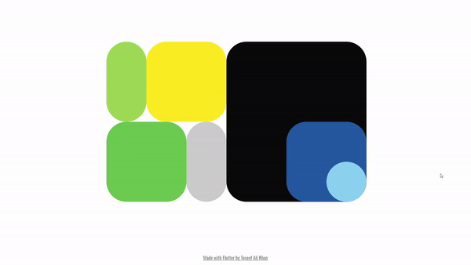
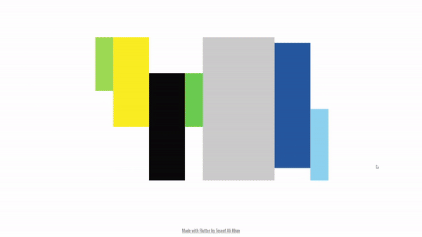
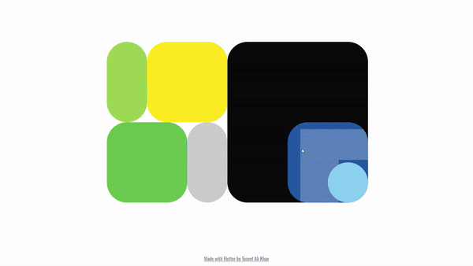

# Portfolio Showcase


Welcome to my portfolio project, developed with Flutter. The design inspiration for this project comes
from Karina Sirqueira. The main page features an attractive layout, utilizing a Stack and implicit
animations to animate shapes seamlessly.\
If you're curious about how I built it, check out my detailed Medium blog [here](https://medium.com/@toseefkhan401/flutter-ui-challenge-animating-shapes-and-their-position-in-flutter-6e2507aad046)!

## Features

- Aesthetic animations
- Responsive shapes adjust dynamically to different screen sizes
- Title preview on hover over shapes
- Interactive animation triggers when clicking on a shape, expanding it to fill the screen and
  transition to a specific section.
- 7 Sections to display projects and a about section
- Hover animation on links offers visual feedback with brighter color transitions.

## How does it work?

- Shapes on the main page are positioned using a Stack widget.


- AnimatedPositioned and AnimatedContainer are used for smooth position and shape animations,
  respectively.
- Periodic timer that randomly selects a shape every 4-second interval.
- AnimatedSwitcher facilitates the text preview on hovering over a shape.


- Hero animation and FadeTransition is used to smoothly transition to a new page on shape click.
- Horizontal scroll view is used for the big title


- PageView widget enables scrolling through the project sections.
- AnimatedRotation adds rotation movement to the icon.
- AnimatedDefaultTextStyle provides color hover animation on links.


- GIFs and descriptive text in various sections effectively showcase different projects.


## Getting Started

### Prerequisites

- Flutter: Ensure you have the latest version of Flutter installed. If not, follow
  the [Flutter installation guide](https://flutter.dev/docs/get-started/install).

### Installation

1. Clone the repository to your local machine:

   ```bash
   git clone https://github.com/toseefkhan403/toseefkhan403.github.io.git

2. Open the project in your preferred code editor.

3. Install the required dependencies by running:

    ```bash
   flutter pub get

4. Run the app on chrome or an emulator:

    ```bash
   flutter run

## License

This project is licensed under the MIT License - see the [LICENSE](LICENSE.md) file for details.
